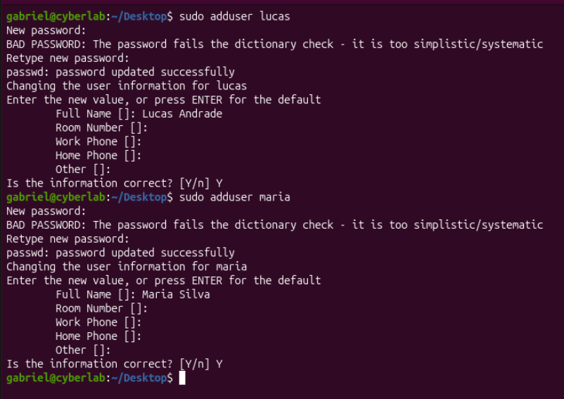
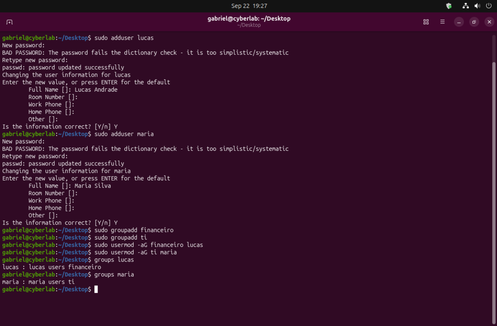
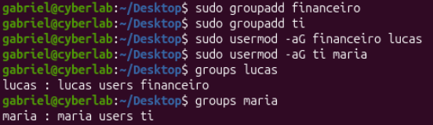
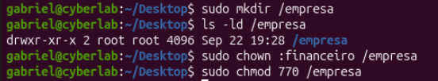
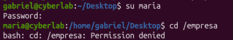

## Access Control Lab

This lab simulates a basic enterprise environment where access to resources is controlled based on user roles and group membership.

The objective is to demonstrate how Linux access control mechanisms can be used to enforce security policies such as least privilege and role-based access control (RBAC).

### Scenario

A company environment was created with different users and departments. Access to a restricted directory is granted only to authorized users based on their group.

### Objectives

- Create and manage users
- Create and assign groups
- Configure directory ownership
- Apply permission rules
- Validate access restrictions

### Steps

#### 1. Create Users

Users were created to simulate employees from different departments.

#### 2. User Details Configuration

Basic user information was configured during creation.

#### 3. Create Groups

Groups were created to represent departments (e.g., financeiro, ti), and users were assigned accordingly.

#### 4. Configure Directory Permissions

A restricted directory was created and configured with specific ownership and permissions.

- Owner: root  
- Group: financeiro  
- Permissions: 770  

#### 5. Access Denied Test

A user without proper permissions attempted to access the directory and was denied.

#### 6. Access Granted Test

A user belonging to the authorized group successfully accessed the directory.

### Key Concepts

- User and Group Management  
- File and Directory Permissions  
- Role-Based Access Control (RBAC)  
- Least Privilege Principle  

This lab demonstrates how proper configuration of users, groups and permissions can enforce access control in Linux systems.
It highlights the importance of restricting access based on roles and validating permissions through testing.

### Note

This lab was performed in a controlled environment for educational purposes.
