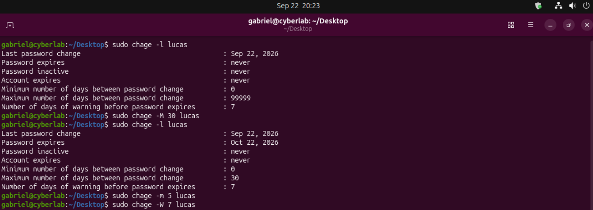
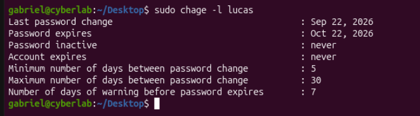

### Password Policy Lab

This lab demonstrates how to implement basic password security policies in a Linux environment, focusing on expiration control and credential management.

#### Objective

Apply essential password security configurations, including:

- Password expiration policy
- Minimum time between password changes
- Warning period before expiration

#### Initial Scenario

By default, the system allows passwords to never expire, which represents a security risk.

##### Before Configuration



#### Implementation

The `chage` command was used to apply password policies to a user:

- Set password expiration to 30 days:
  ```bash
  sudo chage -M 30 lucas
  
- Set minimum days between password changes to 5:
  ```bash
sudo chage -m 5 lucas

- Set warning period to 7 days before expiration:
  ```bash
sudo chage -W 7 lucas

#### After Configuration



### Result
After applying the configuration, the user is required to update the password periodically, improving overall system security.
